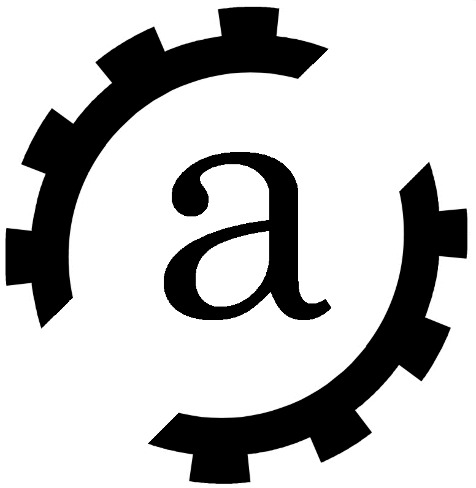

[![Contributors][contributors-shield]][contributors-url]
[![Forks][forks-shield]][forks-url]
[![Stargazers][stars-shield]][stars-url]
[![Issues][issues-shield]][issues-url]
[![MIT License][license-shield]][license-url]
[![LinkedIn][linkedin-shield]][linkedin-url]


# Advanced Django

<!-- PROJECT LOGO -->
<br />
<p align="center">
  <a href="http://apoorvgarg.herokuapp.com/">
    
  </a>

  <h3 align="center">Made By FalseG0d</h3>

  <p align="center">
    A List of Django Apps using some of the lesser known features of Django aimed to teach the Users the transition between a novice and advanced Django Developer.
    <br />
    <a href="https://github.com/FalseG0d?tab=repositories"><strong>Explore Other Projects »</strong></a>
    <br />
    <br />
    ·
    <a href="https://github.com/FalseG0d/AdvancedDjango/issues">Report Bug</a>
    ·
    <a href="https://github.com/FalseG0d/AdvancedDjango/issues">Request Feature</a>
  </p>
</p>


<!-- TABLE OF CONTENTS -->
## Table of Contents

![Product Name Screen Shot][product-screenshot]

* [Getting Started](#getting-started)
* [Prerquisites](#prerquisites)
* [Admin ID Password](#admin-id-password)
* [Built With](#built-with)
* [Video Lectures](#video-lectures)
* [Authors](#authors)
* [License](#license)
* [Acknowledgement](#acknowledgement)


## Getting Started

Simply Open the App or Feature you wish to learn by selecting a folder of your choosing.

1. Clone the repo

```sh
git clone https://github.com/FalseG0d/AdvancedDjango.git
```

2. Install Django Package

```sh
pip install django
```

## Prerequisites

1. Python
2. Pip

## Admin ID Password

1. Username:-Apoorv
2. Username:-password

## Built With

* [Python](http://www.dropwizard.io/1.0.2/docs/) - Programing Language
* [Django](https://maven.apache.org/) - Framework

## Video Lectures

* [Redirect](https://youtu.be/YsHd-l7QdI8) - Lecture 1
* [Humanize](https://youtu.be/i-1UXTp2Onk) - Lecture 2
* [Advanced Django Query](https://youtu.be/zjHLWkdSv1E) - Lecture 3
* [Automatic Date Time Field](https://youtu.be/FTMORnzf3-I) - Lecture 4
* [Merge Query Sets](https://youtu.be/0-NMAtb8txE) - Lecture 5
* [Get Create](https://youtu.be/sWuZla1w3D4) - Lecture 6
* [Get Current URL](https://youtu.be/d3So0GZ13f8) - Lecture 7
* [Blank Or Null](https://youtu.be/UlkPvEYQqps) - Lecture 8
* [Change Password](https://youtu.be/00sdVcuYki0) - Lecture 9
* [Custom Login And Register](https://youtu.be/sD97NMs1l9s) - Lecture 10
* [Chain Multiple Query Sets](https://youtu.be/WskpiwQrmTA) - Lecture 11

## Authors

* **False God** - *Initial work* - [FalseG0d](https://github.com/FalseG0d)

Your Name - [@ApoorvG03132459](https://twitter.com/ApoorvG03132459) - u.garg.10@gmail.com

Project Link: [https://github.com/FalseG0d/AdvancedDjango](https://github.com/FalseG0d/AdvancedDjango)

## License

This project is licensed under the MIT License - see the [LICENSE.md](LICENSE.md) file for details

## Acknowledgments

* **Django Documentation** - *Documentation* - [Documentation](https://github.com/FalseG0d)
* **Inspiration** - *Inspiration* - [Inspiration](https://simpleisbetterthancomplex.com/)


<!-- MARKDOWN LINKS & IMAGES -->
<!-- https://www.markdownguide.org/basic-syntax/#reference-style-links -->
[contributors-shield]: https://img.shields.io/github/contributors/FalseG0d/AdvancedDjango.svg?style=flat-square
[contributors-url]: https://github.com/FalseG0d/AdvancedDjango/graphs/contributors
[forks-shield]: https://img.shields.io/github/forks/FalseG0d/AdvancedDjango.svg?style=flat-square
[forks-url]: https://github.com/FalseG0d/AdvancedDjango/network/members
[stars-shield]: https://img.shields.io/github/stars/FalseG0d/AdvancedDjango.svg?style=flat-square
[stars-url]: https://github.com/FalseG0d/AdvancedDjango/stargazers
[issues-shield]: https://img.shields.io/github/issues/FalseG0d/AdvancedDjango.svg?style=flat-square
[issues-url]: https://github.com/FalseG0d/AdvancedDjango/issues
[license-shield]: https://img.shields.io/github/license/FalseG0d/AdvancedDjango.svg?style=flat-square
[license-url]: https://github.com/FalseG0d/AdvancedDjango/blob/master/LICENSE.txt
[linkedin-shield]: https://img.shields.io/badge/-LinkedIn-black.svg?style=flat-square&logo=linkedin&colorB=555
[linkedin-url]: https://www.linkedin.com/in/apoorv-garg-137137171/
[product-screenshot]: images/programs.png